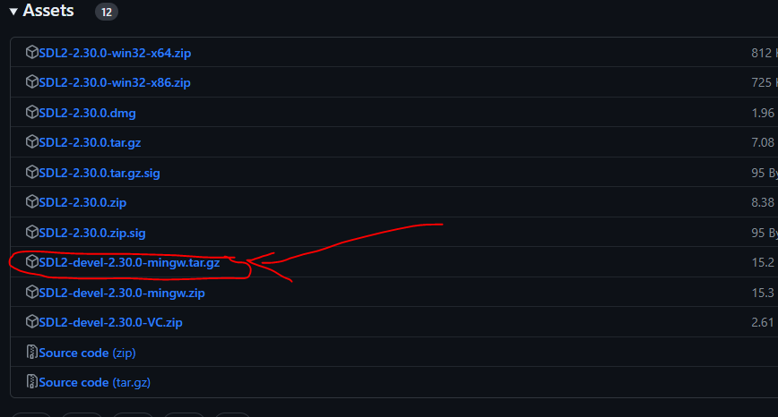

# Setup and build

1. Download and unpack the SDL-devel-mingw32 tar file (Refer image below) from [SDL releases](https://github.com/libsdl-org/SDL/releases) into the current directory.

2. Rename the SDL folder to SDL2.
3. Open an MSYS2 MinGW64 shell.
4. Run `./build.sh`
